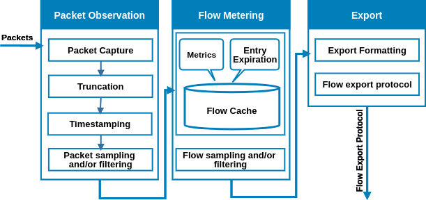

############
Architecture
############

A step by step walk through each process involved when performing flow monitoring is
developed in this section. Our aim is to provide you with a reminder about how
things works in theory. Consequently, an easier understanding of NFStream features
and implementation is possible.

******************
Packet observation
******************

Packet observation is a key stage in a flow monitoring architecture as it is the
starting point. Consequently, we detail in the following each step involved at this
phase:

**Packet capture:** This step is performed on the Network Interface Card (NIC) level.
After passing various checks such as checksum error, packets stored in on-card
reception buffers are moved to the hosting device memory. Several libraries are
available to capture network traffic such as libpcap for UNIX based operating systems
Winpcap for Windows. These libraries are running on the top of the operating system
stack which may reduce performances passing through several layers.
To overcome such limitation in a high speed network context, software optimization
technique are proposed and could be considered (e.g. Intel DPDK, PF-RING, netmap).

**Timestamping:** As packets may come from several observation points, reordering
process is based on packet’s timestamp. While hardware timestamping provides a high
accuracy up to 100 nanoseconds in case of the IEEE 1588 protocol, it’s not supported
by most of commodity NIC. Software timestamping is widely used to outcome this lack
providing an accuracy up to 100 microseconds.

**Truncation (optional):** Defining a snapshot length, the process selects precise
bytes from the packet. It is performed in some cases to reduce the amount of data
captured by the probe and therefore CPU and bus bandwidth load.

**Packet sampling (optional):** is generally performed to reduce load on subsequent
stages. It can be systematic (periodic sampling scheme) or random. The latter is
recommended as periodic scheme may introduce unwanted correlation in the observed
network data.

**Packet filtering (optional):** performs filtering of packets to separate packets
having specific properties from those not having them. A packet is selected if
some specific fields are equal or in the range of given values. Another technique is
a hash based filtering, applying a hash function on a portion of the packet,
the result is compared to a value or a range of values.

*************
Flow metering
*************
It includes packets aggregation into flows and flow entry expiration management.
Second, the metering process associates a packet to a flow entry using a defined key.
Third, it performs the aggregation of packets into flow entry based on a set of metrics.
Then, a flow entry is cached until it is considered as terminated (entry expiration).
Finally, optional steps such as flow sampling and filtering may be performed.

**Flow Cache:** Flow cache consist of table in which the metering process stores
information regarding active flows in the network. A flow key (typically IP source
and destination addresses, source and destination ports, protocol and the VLAN
identifier) determines whether a packet is matching an existing flow entry in the cache
or not. In the first case, flow’s counters are updated. In the latter one, a new entry
is created. Non-key fields are utilized to collect flow metrics (e.g. packets/bytes
count, etc.). If IP addresses are part of flows key, and that traffic between two
pairs generates flows on both directions. We define a flow as bidirectional when we consider that pair and it reverse
belongs to same entry.The cache’s size depends on exporter device memory capacity
and should be configured based on criteria such as key/non-key fields, maximum number
of flows expected and expiration policy.

**Entry expiration:** Cache entries are maintained in the cache table until they are
considered as terminated. Termination of a flow is triggered by an expiration event.
The metering process should consider an entry as expired based on:

* Natural expiration: observed TCP packet belonging to a flow with FIN/RST flag.
* Emergency expiration: flush a certain number of entries to free some space when the cache become full.
* Active timeout: a flow entry expires after being considered active during a certain period (range from 120 seconds to 30 minutes). Counters are reset while start/end timestamp are updated.
* Idle timeout: a flow entry expires if no packets belonging to it are observed during a specific period (range from 15 seconds to 5 minutes).
* Resource constraints: special heuristics such as dynamic timeouts configuration at runtime.
* Cache flush: flush of all the entries due to unexpected situations.

It is possible to configure our metering process based on expiration policy to
reduce the amount of records exported.

**Flow Sampling and Filtering:** Flow sampling and filtering processes are quite like packet sampling and filtering
process explained above. The major differences are the processed unit; while packet sampling and filtering process
packets, flow sampling and filtering process flow records coming from the metering process.

******
Export
******
Export involves two steps which are mainly **formatting** and **export protocol**. While the first decide how an export is
formatted (number of flow per export, json or other, etc.), the latter determine the used
export protocol (file, mqtt, zmq, etc.).